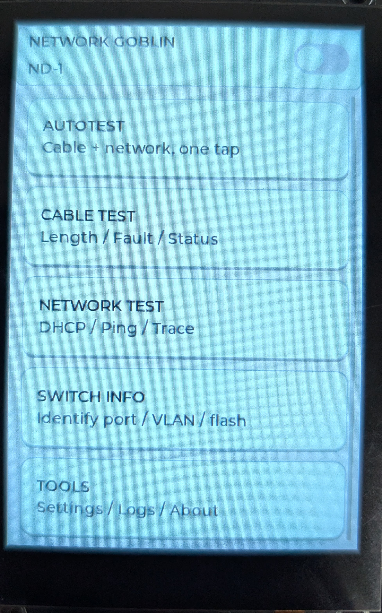
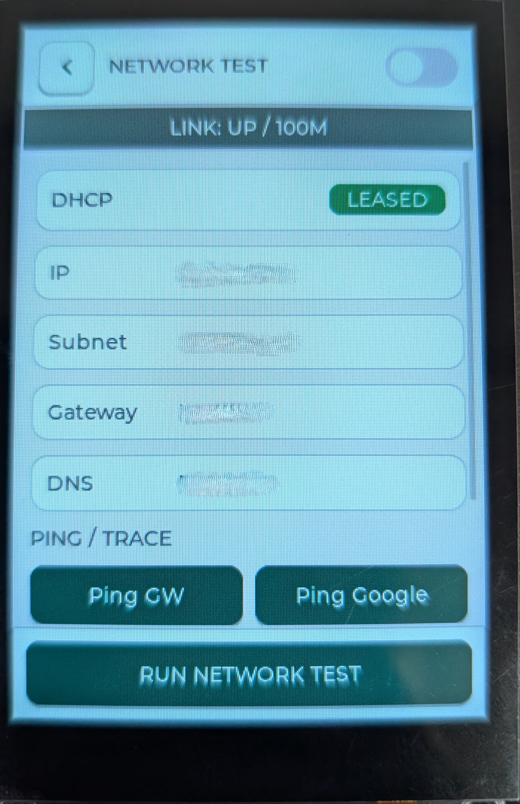
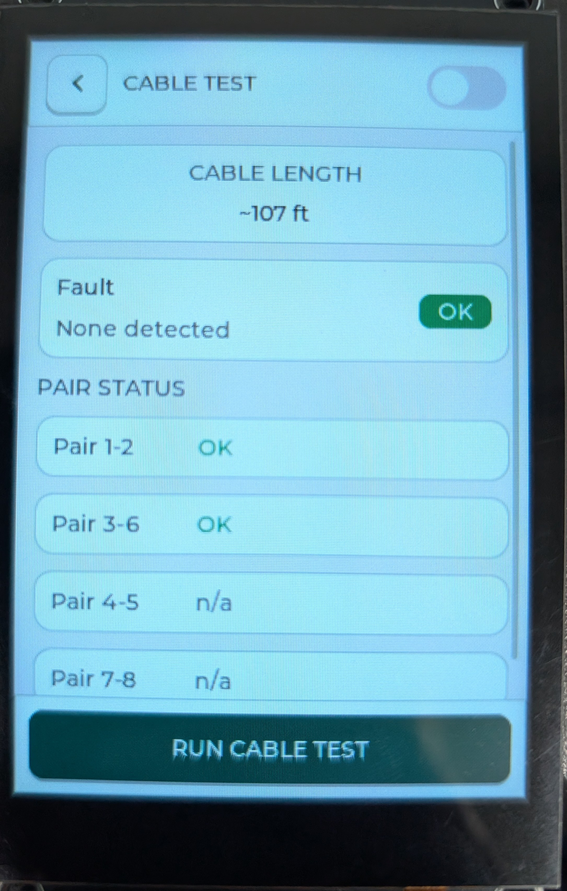
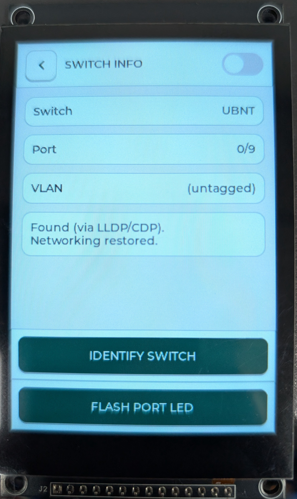

<div align="center">

# 🧌 Network Goblin ND-1

### *"Here be packets."*

**A DIY handheld Ethernet cable & network tester built around a ~$2 PHY chip.**

Cable fault detection (TDR), length estimation, link / DHCP / ping / traceroute,
and switch-port identification (LLDP/CDP) — on a touchscreen, in your pocket,
for a fraction of the cost of a commercial LinkRunner or Pockethernet.


</div>

---

## What is it?

The Network Goblin is a homemade network technician's tool. Plug it into a
drop and it tells you what's wrong with the cable or the connection: is the
cable broken, where's the break, is it linking, is it getting DHCP, can it
reach the gateway and the internet, and *which switch port am I plugged into*.

It's built on the surprising discovery that the **Microchip LAN8742**
Ethernet PHY has a built-in **TDR (Time Domain Reflectometry)** engine — the
same technique the expensive testers use to locate cable faults — that you
can drive directly over the PHY management bus. Pair that with an ESP32, a
touchscreen, and a battery, and you've got a real cable tester for pocket
change.

> ⚠️ **Project status: working prototype.** The dev-kit build is fully
> functional. A custom PCB is in development. This is an active,
> learning-in-public hobby project — expect rough edges.

---

## ✨ Features

### Working now
- ✅ **Cable fault detection (TDR)** — detects **OPEN / SHORT / GOOD** on the
  two active pairs and reports **distance to the fault** in feet.
- ✅ **Per-pair status** — pairs 1-2 and 3-6 tested individually.
- ✅ **Link status** — up/down, 10/100, full/half duplex.
- ✅ **DHCP test** — IP, subnet, gateway, DNS.
- ✅ **Ping** — gateway and Google (8.8.8.8), one tap, no typing.
- ✅ **Traceroute** — gateway and Google.
- ✅ **Switch identification (LLDP / CDP)** — discovers the **switch name,
  port, and VLAN** you're plugged into. Works with a temporary capture that
  pauses networking, then restores it automatically.
- ✅ **Port flash** — blinks the switch's port LED (by cycling the link) so
  you can physically find which port your cable goes to. No SNMP or creds.
- ✅ **AutoTest** — one button: checks the cable, and if it's good, pings the
  gateway and internet, then shows a PASS/FAIL rollup + cable length.
- ✅ **Touchscreen GUI** (LVGL) with a light "business" theme and a dark
  "goblin" hacker theme.
- ✅ **Serial console** — every function is also available over USB serial
  (`id`, `link`, `cable`, `tdr`, `pairs`, `ping <host>`, `trace <host>`,
  `switch`, `flash`).

### Known limitations / rough edges
- ⚠️ **Linked-cable length needs tuning.** When plugged into a live switch,
  cable length comes from the PHY's CBLN register, which is *coarse* and
  currently **over-reports** (an ~18 ft cable may read ~100 ft). It needs
  per-chip calibration against known cable lengths. **Open-cable (TDR) fault
  distance is accurate**; linked-length is a rough estimate for now.
- ⚠️ **Switch ID and networking are mutually exclusive** — identifying the
  switch pauses networking for ~45s, then restores it. (By design; keeps it
  rock-solid.)
- ⚠️ **Port flash is switch-dependent** — the link *does* cycle, but some
  switches (many UniFi/UBNT) don't visibly blink the port LED on link loss.
  Cisco and most managed switches will.
- ⚠️ **Dark mode doesn't persist** across reboots (no settings saved yet).
- ⚠️ **Tools screen is a placeholder.**
- ⚠️ **Traceroute** doesn't yet display intermediate hop addresses reliably.
- ⚠️ **Pairs 4-5 and 7-8** can't be tested at 10/100 (those pairs aren't
  driven). Shown honestly as "n/a." Full 4-pair wiremap needs a gigabit PHY.
- ⚠️ **No battery gauge** on the dev-kit build (planned for the custom PCB).

### Planned / roadmap
- 🔜 **Custom destination** for ping / traceroute (on-screen entry).
- ✅ **Finished Coming in release 1.0.3** **Settings persistence** — remember theme, units, calibration.
- 🔜 **Linked-length calibration** baked in.
- ✅ **Finished Coming in release 1.0.3** **Boot splash + logo, GUI polish, sound.**
- 🔜 **Battery percentage** (custom PCB).
- 🔜 **Screenshot / result logging to SD.**
- ✅ **Finished Coming in release 1.0.3** **Goblin-mode easter eggs** (non-negotiable 🧌).
- ✅ **Finished Coming in release 1.0.3** **Added retry loop for PHY init**

### The bigger idea — "ND-2"
A future, more powerful sibling based on a Linux SBC (e.g. an Orange Pi with
a gigabit NIC): real 4-pair certification, packet capture / Wireshark,
iperf throughput, inline tap / port-mirror target, and security-oriented
tooling. ND-1 stays the cheap, instant-on pocket tester; ND-2 is the
Linux-powered multitool. (Concept stage.)

---

## 🛠️ Hardware

This runs today on an **off-the-shelf dev-kit build** — no custom PCB
required to try it. A custom board is in development.

### Dev-kit build (replicate it now)
| Part | Notes |
|------|-------|
| **ESP32 DevKit (WROOM-32)** | Must be the *classic* ESP32 — it has the built-in Ethernet MAC. **NOT** S3 / S2 / C3 (no EMAC). |
| **LAN8720 RMII module, chip-swapped to LAN8742** | The LAN8742 is footprint-compatible with the LAN8720. Desolder the 8720, reflow an 8742 in its place. This is what gives you the TDR engine. |
| **3.5" SPI touchscreen** | ST7796 driver, FT6336U capacitive touch, 320×480. |
| **Jumper wires / breadboard** | For the RMII + display wiring. |
| **(optional) LiPo + charger** | For untethered use. |

> 🔧 **Two gotchas worth knowing:**
> - The chip swap is a QFN reflow. Doable with hot air + flux + patience
>   (this project's first swap was done one-handed in a sling — it's
>   forgiving). Buy a couple of LAN8742s for spares, and mind orientation.
> - If using the same Elegoo-style ESP32, you'll need to **solder a wire to
>   GPIO0** for the PHY REFCLK.

### Parts list (dev kit)
| Part | Link |
|------|------|
| ESP32 WROOM | https://a.co/d/03k8Kfh2 |
| LAN8720 module | https://a.co/d/0iP2sltR |
| LAN8742A chip | https://ebay.io/m/x2hki5 |
| 3.5" LCD | https://www.aliexpress.us/item/3256805925926605.html |

### Wiring (dev kit)
RMII data pins on the ESP32 are **fixed in silicon**:
```
TXD0=19  TXD1=22  TX_EN=21   RXD0=25  RXD1=26  CRS_DV=27
MDC=23   MDIO=18  50 MHz CLK -> GPIO0 (from the module's oscillator)
PHY address strap = 1
```
Display / touch pins are configurable — see `ng_config.h` (all pins live in
one place; edit there first).

> ⚠️ **The GPIO0 clock quirk:** the module's 50 MHz clock feeds GPIO0, which 
> is also the boot strap pin. You can usually flash with the clock wire 
> **still connected** — but it occasionally gets stuck holding GPIO0 low at 
> boot. If a flash fails or it hangs, just **tap reset a few times** until it 
> catches and boots/uploads normally. (The custom PCB fixes this for good.)

### Custom PCB (in development)
A dedicated board with the LAN8742, ESP32, display connector, LiPo charging,
and a proper power switch is being designed. It is **not fully working yet**
(hardware bring-up in progress). Beta board files will be posted shortly.

> ⚠️ **Not recommended to order the PCB yet** — there are several known
> issues. Watch the repo; files and a BOM will come once it's validated.

---

## 💾 Firmware (Arduino)

Built with the **Arduino IDE** and **LVGL**.

### Requirements
- Arduino IDE 2.x
- **esp32 board package** (Espressif) — v3.x
- Libraries (Library Manager):
  - **lvgl** (9.x)
  - **GFX Library for Arduino** (Arduino_GFX by moononournation)
- An `lv_conf.h` configured for LVGL 9 (see LVGL's Arduino setup notes)

### Build
1. Open the `ND1_Goblin_LVGL` folder in Arduino IDE.
2. Board: **ESP32 Dev Module**. Upload speed: 115200.
3. Edit `ng_config.h` to match your wiring.
4. Upload. If it fails to connect or hangs at boot, tap reset a few times until it catches (The GUI will flash in very quickly during boot. This is how you know it is not stuck in boot low).
5. Serial Monitor @ 115200. Type `help` for commands.

First boot should print the PHY ID (`0x0007C131` for a LAN8742) — that
confirms the chip swap worked.

---

### Screenshots






## 📁 Repo layout
```
network-goblin/
├── README.md
├── LICENSE
├── CONTRIBUTING.md
├── .gitignore
├── images/                   (screenshots / build photos)
└── ND1_Goblin_LVGL/          (open this folder in Arduino IDE)
    ├── ND1_Goblin_LVGL.ino   main sketch (boot + loop + serial console)
    ├── ng_config.h           ALL pins / tunables — edit first
    ├── ng_eth.*              Ethernet (LAN8742) + PHY MDIO + cable length
    ├── ng_tdr.*              TDR cable fault detection (the heart of it)
    ├── ng_pairs.*            per-pair status
    ├── ng_netcmd.*           ping + traceroute
    ├── ng_lldp.*             LLDP/CDP switch ID + port flash
    ├── ng_display.*          LVGL + ST7796 + FT6336U
    └── ng_ui.*               the touchscreen UI (hand-coded LVGL)
```

---

## 🧪 A note on accuracy

This is a **hobby tool, not a certified cable analyzer.** The TDR fault
distance is calibrated against a handful of known cables and gets you
"close" — great for *finding a break*, not for certification. Linked-cable
length (CBLN) is coarse and needs tuning. Treat readings as a very useful
sanity check, not gospel. If you need certified results, buy the $2,000
tool. If you want to know "is this drop broken, and roughly where" for the
price of a nice dinner — welcome to the Goblin. 🧌

---

## 🤝 Contributing

This is an active, learning-in-public project by a self-taught tinkerer.
Issues, PRs, ideas, and "you did this the hard way, here's better" comments
are all welcome. If you build one, I'd love to see it. See
[CONTRIBUTING.md](CONTRIBUTING.md).

> Full disclosure: a lot of this was built with heavy help from AI as a
> learning aid. It's a hobbyist's project, shared openly. Improvements from
> people who actually know what they're doing are very welcome.

## 📜 License

**MIT** — see [LICENSE](LICENSE). Do whatever you want with it. No warranty.
Don't blame the goblin if your cable's still broken.

---

<div align="center">

*Built one-handed, in a sling, after shoulder surgery, out of spite for a
$2,000 price tag. The Goblin endures.* 🧌🔌⚡

</div>
